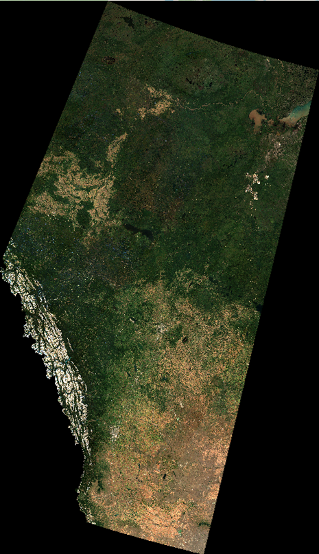
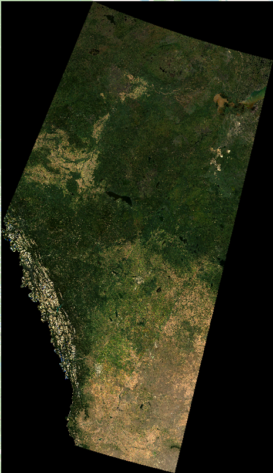
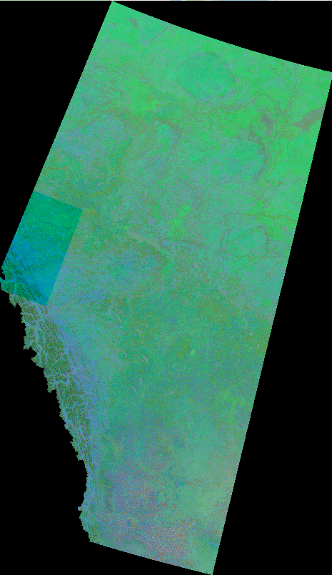
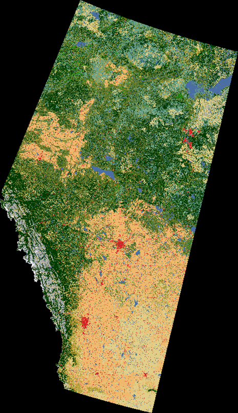

# Hackathon15_AlphaEarth_Alberta

This repository contains a multi-sensor semantic segmentation pipeline for evaluating AlphaEarth dataset potential relative to Sentinel-2 data using Alberta 2020 land cover classification.

## 📋 Overview

The project implements a comprehensive training pipeline for multi-sensor semantic segmentation with:
- Support for Landsat-8, Sentinel-2, and AlphaEarth sensors
- Multiple model architectures (BasicUNet, SwinUNet, SepViTUNet, etc.)
- Comprehensive metrics and experiment tracking with Weights & Biases
- Automatic mixed precision training and advanced data augmentation

## Weights & Biases Integration

The training script automatically handles WandB authentication:
Create wandb_api_key.txt in the project root with your API key.

## 🚀 Quick Start

### 1. Prerequisites

```bash
# Clone the repository
git clone https://github.com/GSIL-UCalgary/Hackathon15_AlphaEarth_Alberta.git
cd Hackathon15_AlphaEarth_Alberta

# Create and activate conda environment (recommended)
conda create -n alphaearth python=3.8
conda activate alphaearth

# Install dependencies
pip install -r requirements.txt

---
```

### 2. Data Processing

1- Download LULC map from
  [Open Canada](https://open.canada.ca/data/en/dataset/ee1580ab-a23d-4f86-a09b-79763677eb47/resource/f1ba2faa-ff10-4526-815a-c57b99eef1bb)

2- Save the downloaded LULC map in `GroundTruth_Landsat_Canada` folder

3- Run preprocessing scripts
```
python GroundTruth_Landsat_Canada/clip_Landsat8_30m_GT.py

```

4- Download AlphaEarth tiles images using preprocessing/AlphaEarth_Dataset/Alberta_ALphaEarth_2020.js in GEE code editor

5- Then run the codes below in order to get images

```
python preprocessing/AlphaEarth_Dataset/merging_tiles_AlphaEarth_30m_01.py
python preprocessing/AlphaEarth_Dataset/clip_merged_AlphaEarth_30m_images_02.py
python preprocessing/AlphaEarth_Dataset/stack_clipped_AlphaEarth_30m_images_03.py
```
5- Do the same process for Landsat-8 and Sentinel-2 datasets

6- Extract patches for all datasets
```
python preprocessing/extract_patches_alldatasets.py
```


---
<table>
  <tr>
    <td align="center" valign="top">
      
      <b>Sentinel-2</b>
    </td>
    <td align="center" valign="top">
      
      <b>Landsat-8</b>
    </td>
    <td align="center" valign="top">
      
      <b>AlphaEarth</b>
    </td>
    <td align="center" valign="top">
      
      <b>Ground Truth</b>
    </td>
    <td align="center" valign="top">
      <br/>
      <b>Color Index</b>
    </td>
  </tr>
</table>

---

### 3. Dataset Structure

After preprocessing, you'll get:

```
train_val_test_patches/
├── LC_remapped.tif
├── LC_filtered.tif
├── label_mapping_metadata.json
├── multisensor_dataset_config.json
├── abundance_maps/
│   ├── class_0_abundance.tif
│   ├── class_1_abundance.tif
│   ├── ...
│   └── class_N_abundance.tif
├── patches/
│   ├── train/
│   │   ├── landsat8/
│   │   │   └── img/
│   │   │       ├── class_<class_id>_patch_<id>.tif
│   │   │       └── ...
│   │   ├── sentinel2/
│   │   │   └── img/
│   │   │       ├── class_<class_id>_patch_<id>.tif
│   │   │       └── ...
│   │   ├── alphaearth/
│   │   │   └── img/
│   │   │       ├── class_<class_id>_patch_<id>.tif
│   │   │       └── ...
│   │   └── labels/
│   │       ├── filtered/
│   │       │   ├── class_<class_id>_patch_<id>.tif
│   │       │   └── ...
│   │       └── unfiltered/
│   │           ├── class_<class_id>_patch_<id>.tif
│   │           └── ...
│   ├── val/
│   │   └── (same structure as `train`)
│   └── test/
│       └── (same structure as `train`)

```

### 4. Training

```
# Basic training with Landsat-8
python train.py --config config/landsat_config.yaml --label_type filtered

# Train with Sentinel-2
python train.py --config config/sentinel_config.yaml --label_type filtered

# Train with AlphaEarth
python train.py --config config/alphaearth_config.yaml --label_type filtered
```

### 5. Scene classifications

First, run the `python create_alberta_ground_truth.py` code to get landcover-2020-classification_CLIPPED_ALBERTA_REMAPPED.tif

Then, run `python scene_classification.py --sensor_name landsat8 --evaluate` to get the scene classificaiton and classification metrics.
